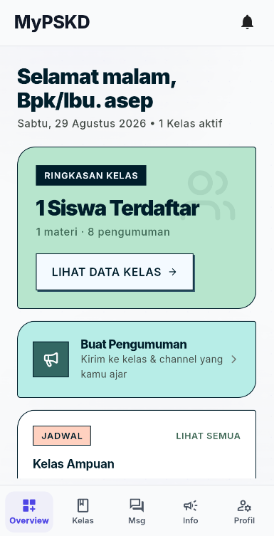
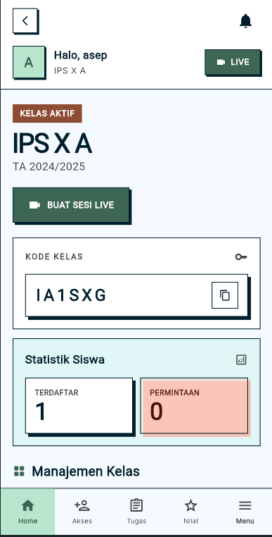
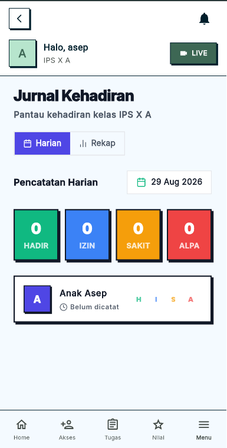
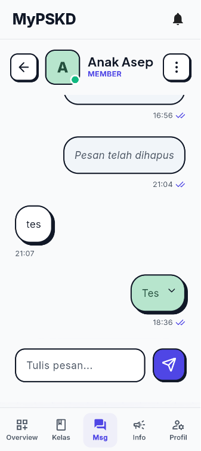
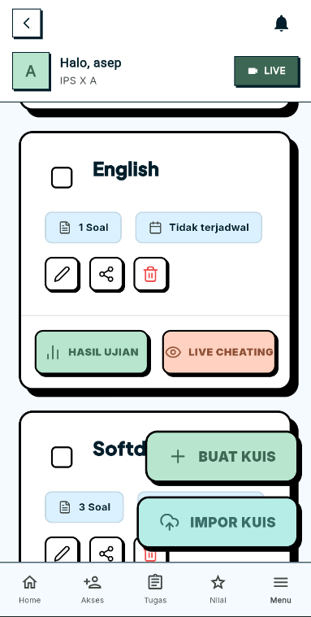
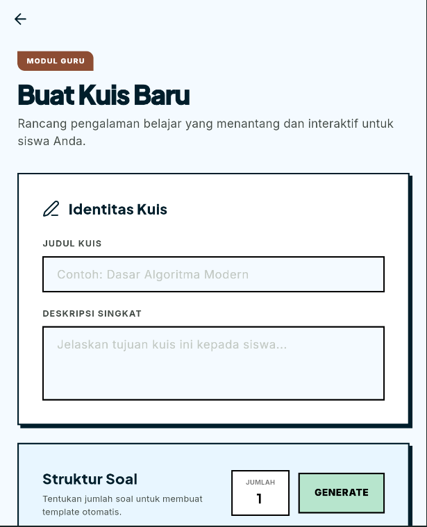
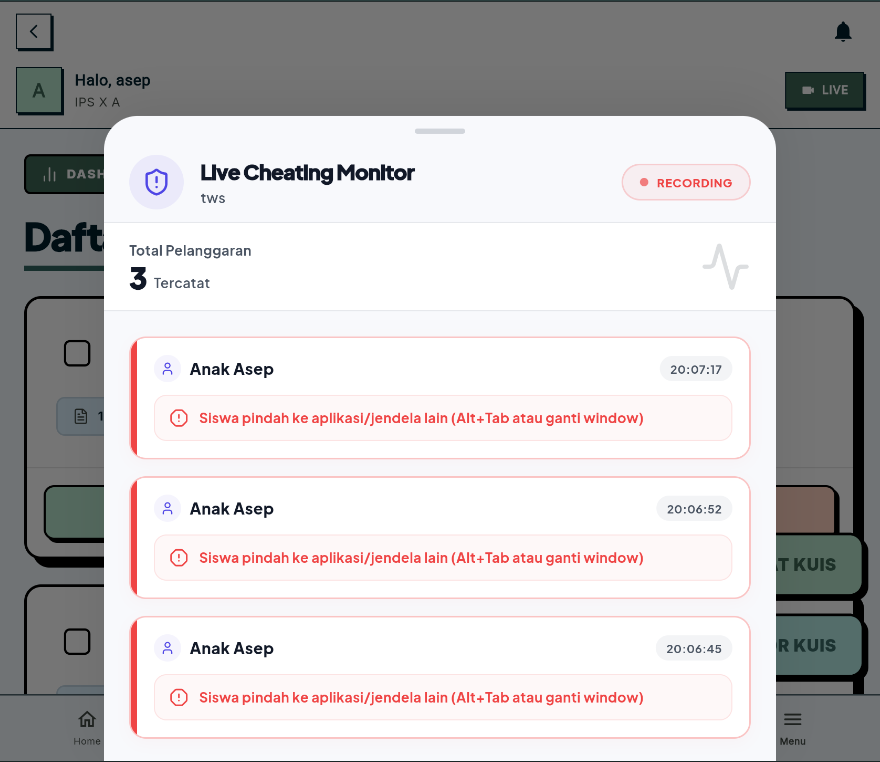
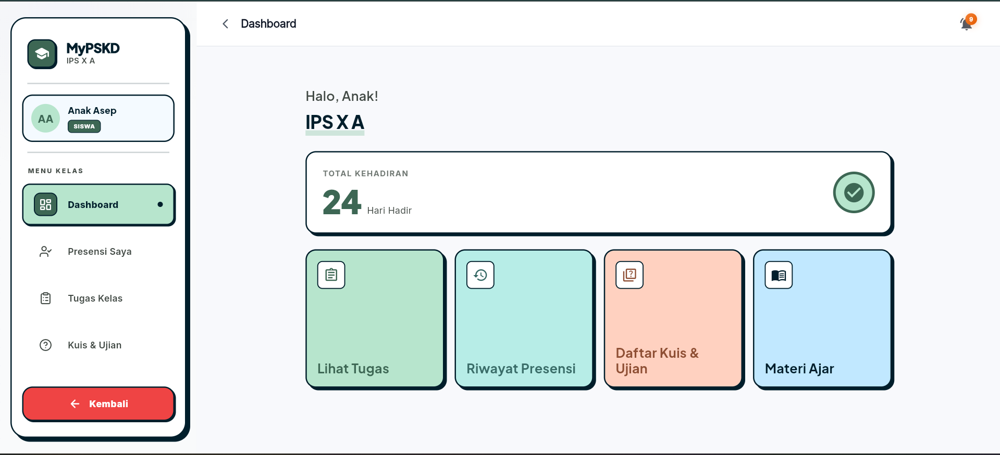
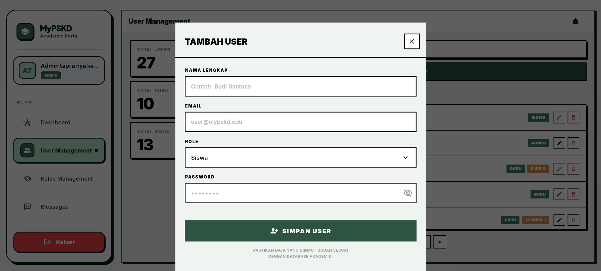
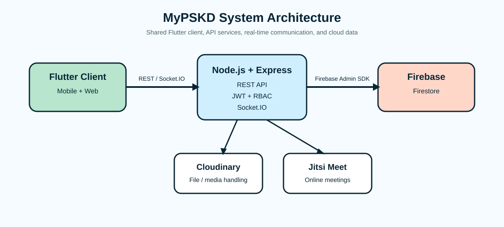

# MyPSKD — School Learning Management System

A portfolio case study of **MyPSKD**, a full-stack Learning Management System (LMS) developed collaboratively for school learning, assessment, communication, and classroom management across mobile and web.

> **Case study note**
>
> This repository documents the product, engineering decisions, and my individual contribution. The application source code remains in the original team repository and is intentionally not duplicated here.
>
> **Original team repository:** https://github.com/Elvan1210/SoftwareDevelopment-Project-Kelompok9

## Project Snapshot

- **Project period:** March–June 2026
- **Context:** Academic Software Development capstone
- **Team:** 5-person core development team
- **Platforms:** Mobile and web from a shared Flutter codebase
- **Users:** Students, teachers, and administrators
- **Process:** Scrum across 7 sprints

## The Product

School learning workflows are often fragmented across separate tools for assignments, attendance, grades, announcements, communication, meetings, and examinations. MyPSKD was designed to bring those workflows into one role-based platform.

The system supports three primary roles — **Student, Teacher, and Admin** — with different permissions and workflows.

### Core Capabilities

- Class joining and classroom management
- Learning materials and assignments
- Attendance, grades, and teacher feedback
- Announcements, channels, and notifications
- Private and group messaging
- Digital quizzes and examinations
- Auto-save and configurable exam settings
- Teacher-side live exam monitoring
- Tab-switch event logging during examinations
- Online meeting integration

## Product Walkthrough

### Teacher Experience

<table>
<tr>
<td width="50%"></td>
<td width="50%"></td>
</tr>
<tr>
<td align="center"><strong>Teacher Dashboard</strong></td>
<td align="center"><strong>Class Management</strong></td>
</tr>
</table>

<table>
<tr>
<td width="50%"></td>
<td width="50%"></td>
</tr>
<tr>
<td align="center"><strong>Attendance Journal</strong></td>
<td align="center"><strong>Messaging</strong></td>
</tr>
</table>

### Digital Assessment

<table>
<tr>
<td width="50%"></td>
<td width="50%"></td>
</tr>
<tr>
<td align="center"><strong>Quiz Management</strong></td>
<td align="center"><strong>Exam Configuration</strong></td>
</tr>
</table>

The examination workflow includes configurable assessment settings and teacher-side monitoring. Tab-switch events are treated as **behavioral signals**, not as proof of cheating.

### Student and Admin Roles

The web views demonstrate the same product serving different user roles while adapting its interface and available actions to each role.

## My Role & Contributions

This was a **collaborative team project**. My responsibilities evolved during development rather than remaining within one fixed role.

I initially focused heavily on **Flutter frontend implementation and UI/UX**, especially responsive teacher-facing and classroom workflows. As the project grew, I also worked across **backend routes, Firestore integration, messaging behavior, notifications, and feature integration**.

Selected contributions visible in the original repository include:

- Redesigned and refined the **Teacher Dashboard and teacher classroom views**
- Improved responsive Flutter behavior across **mobile and web**, including navigation, overflow handling, class views, quizzes, learning materials, attendance, and grading
- Extended messaging with **message unsend, per-user clear chat, leave-group behavior, polling, and Socket.IO fixes**
- Improved assignment workflows so new assignments could be **posted to class channels** and generate **student notifications**
- Implemented backend/Firestore behavior for teacher announcements, including **notifications and channel posting**
- Refined teacher workflows for class access, assignments, grades, announcements, and classroom navigation
- Participated in testing, debugging, integration, and feature refinement throughout development

### Contribution Evidence

Merged pull requests under my GitHub account (`nallievira`) include:

- [PR #67 — Messaging: unsend, clear chat, leave group, polling, and socket fixes](https://github.com/Elvan1210/SoftwareDevelopment-Project-Kelompok9/pull/67)
- [PR #68 — Responsive UI and teacher workflow improvements, including assignment notifications](https://github.com/Elvan1210/SoftwareDevelopment-Project-Kelompok9/pull/68)
- [PR #81 — Teacher Dashboard and teacher classroom UI redesign](https://github.com/Elvan1210/SoftwareDevelopment-Project-Kelompok9/pull/81)
- [PR #89 — Teacher classroom views, access workflow, and assignment UI](https://github.com/Elvan1210/SoftwareDevelopment-Project-Kelompok9/pull/89)

These links make my contribution to the collaborative codebase directly traceable.

## Technology Stack

| Layer | Technologies |
| --- | --- |
| Client | Flutter / Dart — shared mobile and web application |
| Backend | Node.js, Express |
| Database | Firebase Firestore |
| Authentication & authorization | JSON Web Tokens (JWT), Role-Based Access Control (RBAC) |
| Real-time communication | Socket.IO |
| File/media handling | Cloudinary |
| Online meetings | Jitsi Meet integration |
| Deployment | Vercel |

## System Architecture

The shared Flutter client connects to Node.js/Express services through REST APIs and Socket.IO. Backend services handle authentication and role authorization, persist application data in Firestore, and integrate external services such as Cloudinary and Jitsi Meet.

## Engineering Decisions

### Role-based workflows

Students, teachers, and administrators interact with the same school data differently, so permissions and role-specific workflows were part of the product architecture rather than only a login concern.

### Responsive mobile and web experience

A shared Flutter codebase reduced duplication, but the team still had to adapt navigation, layout, and interaction patterns for different screen sizes. Several iterations focused specifically on responsive classroom workflows.

### Assessment monitoring without overclaiming

The examination system records tab-switch activity and exposes it to teachers during monitoring. This is presented as a **monitoring signal**, not as a guarantee that cheating can be detected or prevented.

### Persistent and real-time communication

Messaging combined Socket.IO behavior with Firestore-backed conversation state. Features such as unsend, clear chat, group leaving, and mobile polling required coordination between UI state, backend routes, and persisted data.

## Development & Testing

The project was developed using **Scrum over 7 sprints**, with features implemented and refined iteratively.

Quality work included:

- **Black-box testing** of application functionality
- **User Acceptance Testing (UAT)**
- Software-quality evaluation informed by **ISO/IEC 9126** quality characteristics

Testing helped identify both local feature bugs and cross-feature integration issues between roles, platforms, backend logic, and persisted data.

## Outcome

MyPSKD reached a demonstrable end-to-end product state and was presented at a university project exhibition. Feedback included encouragement to explore **commercializing the system**, which helped frame the work as a potential product rather than only a classroom prototype.

## What I Learned

The project gave me experience beyond implementing isolated features. Key takeaways included:

- Building across frontend, backend, and database boundaries
- Translating school workflows into role-based product features
- Developing responsive behavior across mobile and web
- Working with real-time communication and persistent application state
- Debugging integration issues across multiple layers
- Coordinating changing responsibilities in a collaborative team
- Balancing usability, implementation constraints, and delivery
- Evaluating a working system through testing and user acceptance

## Repository Purpose

This repository is intentionally a **case study**, not a duplicate of the original team source repository. It exists to present the product, engineering context, and my contribution clearly for portfolio review while preserving the original source and contribution history in the linked team repository.
